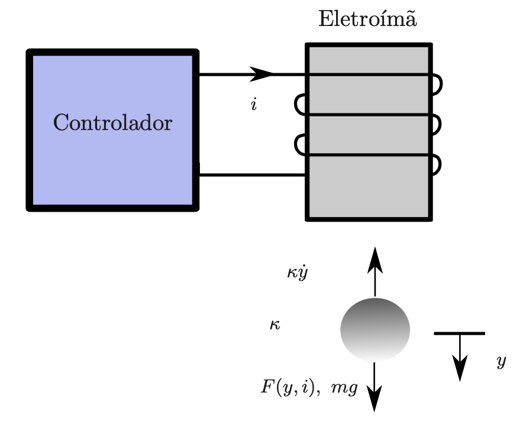
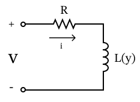
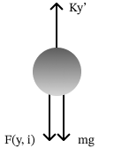

# Projeto Controle de um Levitador Magnético

### ES710 - Controle de sistemas mecânicos

#### Alunos
- Gabriel Muelas Urano, 234944
- Luigi De Salvo Miotti, 221040

## Introdução

$$L(y) = L_1 + \frac{L_0}{1+y/a}$$
$$F(y, i) = -\frac{L_0i^2}{2a(1+y/a)}$$
$$\phi = L(y)i$$

## Análise do Sistema a Tempo Contínuo

### Modelo não-linear

- #### Sistema Elétrico

$$v = Ri + \dot\phi$$
$$v = Ri + (L(y)'\cdot i + L(y)\cdot i')$$
$$v = Ri + \left( -aL_0\frac{y'}{(a+y)^2}i + L_1i' + \frac{aL_0}{a+y}i'\right)$$
$$v = \left[ R - aL_0\frac{y'}{(a+y)^2} \right]i + \left[ L_1 + \frac{aL_0}{a+y}\right]i'$$

- #### Sistema Dinâmico
  

$$my'' = F(y, i) + mg - \kappa y'$$
$$my'' + \frac{L_0i^2}{2a(1+y/a)^2} - mg + \kappa y' = 0$$

### Representação em espaço de estados

Adotamos as seguintes variáveis de estado $\xi_1=y,\; \xi_2=y',\; \xi_3=i$, entada de controle $u_N=-v$ e saída $z_N=\xi_1$.

Reescrevendo as equações do sistema não-linear, obtemos
$$v - \left[ R - aL_0\frac{y'}{(a+y)^2} \right]i = \left[ L_1 + \frac{aL_0}{a+y}\right]i'$$
$$i' = \frac{v - \left[ R - aL_0\frac{y'}{(a+y)^2} \right]i}{ L_1 + \frac{aL_0}{a+y}}$$

e
$$my'' + \frac{L_0i^2}{2a(1+y/a)^2} - mg + \kappa y' = 0$$
$$y'' = g - \frac{\kappa}{m}y' - \frac{aL_0i^2}{2m(a+y)^2}$$

Portanto, a representação em espaço de de estados é dada por

$$\xi_1' = \xi_2$$
$$\xi_2' = g - \frac{\kappa}{m}\xi_2 - \frac{aL_0\xi_3^2}{2m(a+\xi_1)^2}$$
$$\xi_3' = \frac{-u_N - \left[ R - aL_0\frac{\xi_2}{(a+\xi_1)^2} \right]\xi_3}{ L_1 + \frac{aL_0}{a+\xi_1}}$$

### Posicao de equilibrio

Desejamos manter a bola em equilibrio na posicao $y_e=0$, isto é, encostada no eletroima. Para isso adotamos que $y^{(n)}=0$, com $n$ sendo a $n$-ésima derivada no tempo. Aplicando estas cpndicoes nas equacoes do modelo não-linear obtemos:

$$0 + \frac{L_0i_e^2}{2a(1+0)^2} - mg + 0 = 0$$
$$\frac{L_0i_e^2}{2a} - mg = 0$$
$$i_e = \sqrt{\frac{2amg}{L_0}} $$
e
$$v_e = \left[ R - 0 \right]i_e + \left[ L_1 + \frac{aL_0}{a+0}\right]i'_e$$
$$v_e = Ri_e + L_1i'_e + L_0i'_e$$

Como em regime permanente a corrente fica constante, então $i'_e = 0$ e, portanto, temos

$$v_e = Ri_e$$

Concluímos que para manter a bola em equilibrio na posicao $y_e = 0$ precisamos que $i_e = \sqrt{\frac{2amg}{L_0}}$ e $v_e = Ri_e$

### Modelo linearizado

A linearização das equações em torno do ponto de equilíbrio $(y_e, \dot{y}_e, i_e)$ é dada pela expansão de Taylor em primeira ordem

$$f(y, \dot{y}, i) = f(y_e, \dot{y}_e, i_e) + \frac{\partial f(y_e, \dot{y}_e, i_e)}{\partial y}(y-y_e) + \frac{\partial f(y_e, \dot{y}_e, i_e)}{\partial \dot{y}}(\dot{y}-\dot{y}_e) + \frac{\partial f(y_e, \dot{y}_e, i_e)}{\partial i}(i-i_e) $$

O resultado desta expansão para as equações do sistema não-linear é dado por

$$v - Ri + \frac{L_0i_e}{a}y'-(L_0+L_1)i'=0$$
$$y''- g + \frac{k}{m}y'+ \frac{L_0i_e}{ma}\left[\frac{i_e}{2} + (i-i_e) - \frac{i_e}{a}(y-y_e)\right]=0$$